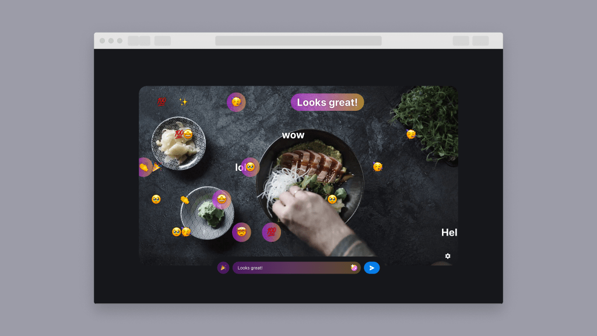

# Amazon IVS Bullet Chat Web Demo

A demo web application intended as an educational tool to demonstrate how you can build a bullet chat application with [Amazon IVS](https://aws.amazon.com/ivs/).

**This project is intended for education purposes only and not for production usage.**

This is a react web application, leveraging [Amazon IVS](https://aws.amazon.com/ivs/) for video streaming and chat. It requires the serverless backend from the [Amazon IVS Chat](https://github.com/aws-samples/amazon-ivs-chat-web-demo/blob/main/serverless/README.md). You must deploy the Serverless backend to get an `API_URL`.

The demo showcases how you can implement a simple live streaming application with video and chat using Amazon IVS. Viewers are asked to enter their name the first time they begin chatting. Chat users can send plain text messages, text links, emojis, and stickers. Chat moderators can delete messages and kick users.

## Prerequisites

- [NodeJS](https://nodejs.org/) with `npm`
- The `API_URL` output from the [Amazon IVS Chat Serverless backend](https://github.com/aws-samples/amazon-ivs-chat-web-demo/blob/main/serverless/README.md). You must deploy the Serverless backend to get an `API_URL`.
- The `ARN` of an Amazon IVS Chat room. You must create an Amazon IVS Chat room to get a chat room ARN. Refer to [Getting Started with Amazon IVS Chat](https://docs.aws.amazon.com/ivs/latest/userguide/getting-started-chat.html) for a detailed guide.

## Run the demo

Follow these instructions to run the demo:

1. Open `src/config.js` and replace the following values:
   - Replace `<API_URL>` with the `API_URL` from the prerequisites section.
   - Replace `<ROOM_ID>` with the `ARN` from the prerequisites section.
   - Replace `<AWS_REGION>` with the AWS region of the chat room. For example, if you created your chat room in the us-west-2 (Oregon) region, enter `us-west-2`.
2. Run: `npm install`
3. Run: `npm start`

## Known issues and limitations

- The application is meant for demonstration purposes and **not** for production use.
- This application is only tested in the us-west-2 (Oregon) region. Additional regions may be supported depending on service availability.
- Message and user data for this demo is not saved/persistent (ie. reloading the page would go back to initial state).

## About Amazon IVS

Amazon Interactive Video Service (Amazon IVS) is a managed live streaming and stream chat solution that is quick and easy to set up, and ideal for creating interactive video experiences. [Learn more](https://aws.amazon.com/ivs/).

- [Amazon IVS docs](https://docs.aws.amazon.com/ivs/)
- [User Guide](https://docs.aws.amazon.com/ivs/latest/userguide/)
- [API Reference](https://docs.aws.amazon.com/ivs/latest/APIReference/)
- [Setting Up for Streaming with Amazon Interactive Video Service](https://aws.amazon.com/blogs/media/setting-up-for-streaming-with-amazon-ivs/)
- [Learn more about Amazon IVS on IVS.rocks](https://ivs.rocks/)
- [View more demos like this](https://ivs.rocks/examples)

## Security

See [CONTRIBUTING](CONTRIBUTING.md#security-issue-notifications) for more information.

## License

This library is licensed under the MIT-0 License. See the LICENSE file.
